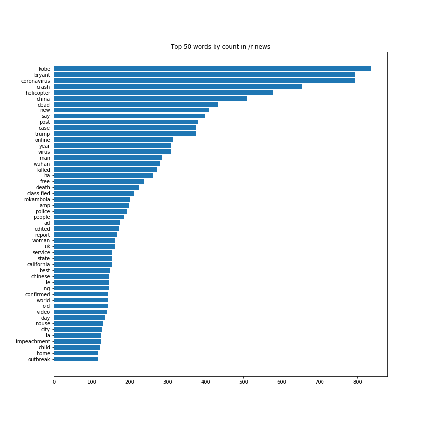

# Executive Summary

## Classifying Subreddits: /r worldnews VS. /r news 

### *Author: Brendan Lo*
---

## Problem Statement

- News channels need to understand what information to broadcast to its audiences. Because news channels are still businesses, it's important to consider the balance between the social responsility of sharing accurate, important news, and news that generates viewership. It is common knowledge that an increasing amount of news is consumed online over television. 

- In this study we will use Natural Language Processing to create a classifying model bewteen the two largest news related subreddits: **/r worldnews** and **/r news**. 

- By diving deeper into the behavior of the online community on how they share and consume news locally and globally, we can gain insights on how our own news can be presented to our rapidly growing online audiences. 

___

## Contents:
- [Scraping & Data Cleaning](#Scraping-&-Data-Cleaning)
- [Exploratory Data Analysis & Preprocessing](#Exploratory-Data-Analysis-&-Preprocessing)
- [Modeling & Evaluation](#Modeling-&-Evaluation)
- [Conclusions & Recommendations](#Conclusions-&-Recommendations)

 
 

___

## Scraping & Data Cleaning

The data studied in this project was scraped using the [pushshift.io API](http://jse.amstat.org/v19n3/decock/DataDocumentation.txt) developed for reddit. 10,000 submissions (also known as posts) from each subreddit were used as data for our model. 

### Data Cleaning

Since the bulk of our analysis is on the basis of NLP, the only data that we use from the scraped data is the text data. Specifically, the 'selftext' data containing the post's text, the 'title' data which referred to the title of the post, and of course the 'subreddit' data indicating which forum the data belongs to.

 

**Cleaning NaN Values**  
NaN values were found in the data set of the total of 20,000 submissions, however none of those NaNs were in the 'selftext' or 'title' data that we retained, so those were ignored.

 

**Referencing/Mapping**  
The subreddit of each post was mapped into either 1 or 0. For the sake of this project, 1's refer to worldnews and 0's refer to news. Using 1 as reference, we can also figure out our basline score to compare our models to by finding the distribution of 1's and 0's.  

Since we got an equal amount of posts from the two subreddits, the amount of 1's (worldnews) is exactly 50% of the total data points. We can say that if we guess 1 everytime to be the subreddit a post belongs to, we will be correct about 50% of the time, and is the basline score our models should outperform.

___

## EDA & Pre-processing

### Pre-processing with *Regular Expressions*
Before doing any additional analysis, a few more changes were made to our text data to make it more analyzable.

- *filtered the text to only keep english letters*. We were working with news from all over the world and although english was the primary language there were a wide variety of language characters in our data.  

- *filter out urls/weblinks*. As with many subreddits, alot of hyperlinks and images are used in these forums for discussion. For the purpose of our model analyzing language, we will omitt urls.  

- lemmatized our words. Lemmatizing is the process of returning a word to its *lemma*, or base dictionary  form. We do this to avoid overlaps of words with clear similar meanings such as *running* vs *run*.
- filtered out a few words that were either jiberish or shouldn't be included in the analysis:*[news|com|www|https|bit|ly]*

### Feature Engineering  
Before further analyzing, I also decided to create an additional feature called "sentiment". The Sentiment Analysis uses the **SentimentIntensityAnalyzer** from nltk that looks at individual words and rates the whole body of text between -1 and 1, 1 being positive, -1 being negative, and 0 being neutral.

Understanding the sentiment can give us some insight on what type of news is more prominent in each subreddit - either positive or negative news?

 

### Data Exploration

 

**What Do we See?**   
Looking at the distributions of the two subreddits, we can see that majority posts from both subreddits stay within about 30 words. However, we can also see the **/r news** has a longer tail to the right, suggesting that **/r news** is more likely to have news posts that go more into detail of its articles/subjects.

  

**What Do we See?**  
We can see that on average posts from **/r worldnews** are a little more positive than posts from **/r news**. We can also see that unfortunately, most news reported in those subreddits lean toward negative sentiment.

**What Do we See?**  
By comparing the top 50 words of each subreddit, you can infer that user of **/r worldnews** do indeed post more 'globally' relevant news where as **/r news** has more 'locally' relevant news.  

For example, *coronavirus* was a top hit in worldnews, which is a conscern universally, where as *kobe bryant* was a top hit in local news. Although Kobe is arguably a worldwide phenomenon, we can see that users of **/r news** valued the Basketball Legend native to the US more highly.

___
## Modeling & Evaluation

The two main estimating models used in this project were **Logisitc Regression** and **Random Forests**. In conjunction with these models, Natural Language Processing transformers Count Vectorizer and Tfidf Vectorizer were applied to our text data, while we also applied a standard scaler to our numeric data to have all our features be evaluated on similar scales.  

#### Hyperparameter Dictionary 
The documentation of paramters used in this study. All definitions were taken from official documentation of sklearn.

**Logistic Regression**
- *penalty* - logisitic regresion penalty type. l1 is "LASSO" method and l2 is "Ridge" method.  

**Tfid Vectorizer**
- *max_df* - When building the vocabulary ignore terms that have a document frequency strictly higher than the given threshold (corpus-specific stop words). If float, the parameter represents a proportion of documents, integer absolute counts. This parameter is ignored if vocabulary is not None.

- *max_features* - If not None, build a vocabulary that only consider the top max_features ordered by term frequency across the corpus.
- *min_df* - When building the vocabulary ignore terms that have a document frequency strictly lower than the given threshold. This value is also called cut-off in the literature. If float, the parameter represents a proportion of documents, integer absolute counts. This parameter is ignored if vocabulary is not None.
- *ngram_range* - The lower and upper boundary of the range of n-values for different word n-grams or char n-grams to be extracted. All values of n such such that min_n <= n <= max_n will be used. For example an ngram_range of (1, 1) means only unigrams, (1, 2) means unigrams and bigrams, and (2, 2) means only bigrams. Only applies if analyzer is not callable.
- *stop_words* - If ‘english’, a built-in stop word list for English is used. Omitts common words in the english language.  

**Random Forrest**

___

### Best Model:
#### Logistic Regression

**Comparing Accuracy Scores**  
All our models seemed to overfit. The models performed better on the instances of training data verses testing data. In the context of predicintg topics from current news, overfitting a little bit is acceptable because a lot of news is independent of each other, so training a model on predicting current data on current news would fulfill our goals.

Our best model was the logisitc regression model with the below hyperparamters resulting in a 79% accuracy of classifying the correct subbreddit a word is from. Including sentiment analysis in our model improved our accuracy of previous models from 70% to this current iteration of aobut 80%!

 
 
Train Data Accuracy: 0.79  
Test Data Accuracy: 0.71

 
 

**Best hyperparameters:**
{'max_df': 0.9,
 'max_features': 5000,
 'min_df': 4,
 'ngram_range': (1, 2),
 'stop_words': 'english',
 'lr__penalty': 'l2'}
 
  
  
 
Below is a confusion matrix visualizing the predictions of our best model:
 

 

 
**Interpreting Coefficients**  

Below is sorted the most important words to predicting a subreddit. For each occurance of the word "climate", we have 15x the odds of predicint a subreddit to be from **/r worldnews**

___
### Other Models:
#### RandomForrests

**Comparing Accuracy Scores**  
Our Logisitic Regression Model was compared to a RandomForrest model. The RandomForrest model was outperformed by a few percentage points.

Additional parameters could have been explored to improve this model that might have allowed it to outperform our best Logistic Regression model, but due to computing power and time restraints we could not fully explore those options. An increased budget could help us dive deeper into this model workflow in the near future.

 
 
Train Data Accuracy: 0.67  
Test Data Accuracy: 0.66

___
## Conclusions & Recommendations
Through this study, we've gained some insight into the language behavior of some of the largest online news communities on the internet. Both studied subreddits have over 20million subscribers who get notifications for each new post!  

This Classification Model workflow and Analysis could be an example resource for news & media companies looking to understand their online community. Understanding particular words, topics, and sentiments that engage different online communities can help these companies understand what language and words to incorporate in their own content, broadcasts, and articles.

### Recommendations
- Have your relevant teams study these words and important model coefficients generated. They can provide insight on what topics are more engaging and interesting to your audience.

***For example***: study the news from the past month. What are people taking about the most? Should we did additional coverage on those topics? Should we cut down on certain topics?

- Work on ways to actively engage with online consumers. Understanding the online culture, like specific subreddit cultures, and conversing with these users can be very helpful in understanding their opinions which can be useful in targeting certain news to specific audiences.

***For example***: based on the data, 'kobe' and 'trump' were more relevant words to local audiences from **/r news**. If we are doing a segment targeting international/global audiences, how can we change our presentation to engage in the different audience? (*hint: study the model results!*)